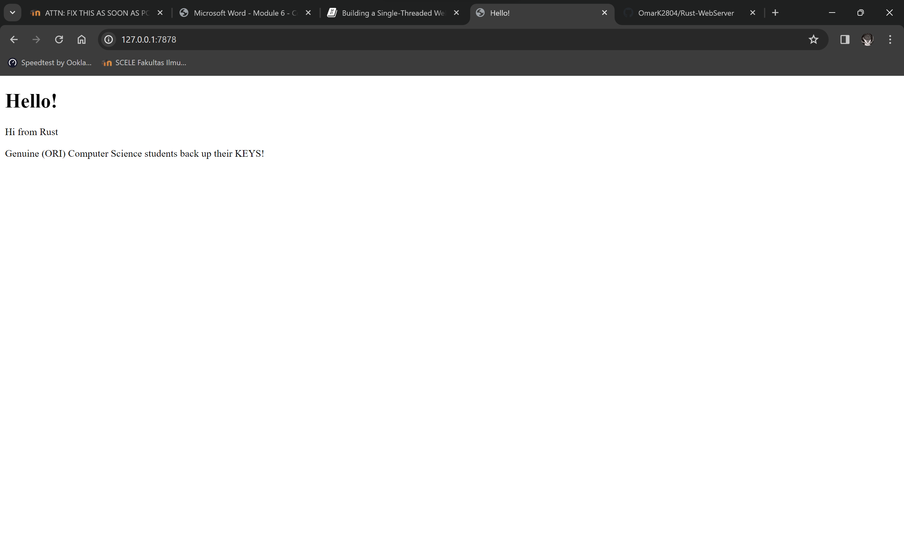
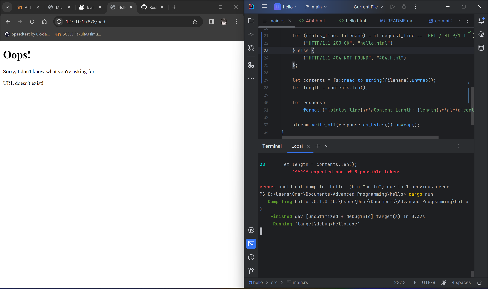

## Tutorial 6

### Commit 1 Reflection notes

The webserver will listen to a TCP streams at address `127.0.0.1:7878`. This is implemented in the function `main`. After listening to the TCP stream, I make a new function called `handle_connection` based on the principle of separation of concerns to read and print the data from the TCP stream. I did this, so I can view the data being sent from the browser. After knowing what the browser data request is, we can send the requested data back to the web.

To break down the code for `main` function, it uses `TcpListener` so we can listen for TCP connections at the address `127.0.0.1:7878`. It also uses the `bind` function. The `bind` function in this scenario works like the `new` function in that it will return a new `TcpListener` instance. Then there's a for loop to process each connection in turn and produce a series of streams for us to handle. For each incoming connection, it calls the `handle_connection` function to process it.

For the `handle_connection`, it takes a TCP stream as input. It creates a new `BufReader` instance that wraps a mutable reference to the stream (read the stream). It will read lines until it encounters an empty line (signifying the end of the HTTP request headers). Then, it collects the lines into a vector representing the HTTP request and print it on the terminal.

### Commit 2 Reflection notes

### Commit 3 Reflection notes

Refactoring is needed to make the code more concise by pulling out those differences into separate if and else lines. If and else blocks have a lot of repetition, they’re both reading files and writing the contents of the files to the stream. The only differences are the status line and the filename.

### Commit 4 Reflection notes

Because I want to simulate the slow response, when `/sleep` url is run, I intentionally make the server sleep for 5 seconds before responding.